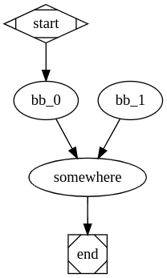

# CS6120: CS 6120: Advanced Compilers γ
[link] (https://www.cs.cornell.edu/courses/cs6120/2020fa/)

## 1.cfg
jmp.bril
```
@main {
  v: int = const 4;
  jmp .somewhere;
  v: int = const 2;
.somewhere:
  print v;
}
```

run:
```
bril2json < ~/bril/test/interp/jmp.bril | python3 cfg.py
```

output:



## 2.lvn
simple.bril
```
@main {
  a: int = const 4;
  b: int = const 2;
  c: int = const 1;
  d: int = add a b;
  print d;
}
```

run:
```
bril2json < ~/bril/examples/test/tdce/simple.bril | python3 lvn.py
```

output:
```
In original CFG, there are # inst = 5, # variable used = 6

==========================Optimization Verbose is On==========================
start optimization with # instuction 5
        constant folding! The instruction is converted from {'args': ['a', 'b'], 'dest': 'd', 'op': 'add', 'type': 'int'} to {'args': [4, 2], 'dest': 'd', 'op': 'add', 'type': 'int'}
        common subexpression elimination! The instruction is converted from {'args': [4, 2], 'dest': 'd', 'op': 'add', 'type': 'int'} into {'dest': 'd', 'op': 'const', 'value': 6}
        constant folding! The instruction is converted from {'args': ['d'], 'op': 'print'} to {'args': [6], 'op': 'print'}
        dead code elimination! delete instruction {'dest': 'd', 'op': 'const', 'value': 6}
        dead code elimination! delete instruction {'dest': 'c', 'op': 'const', 'type': 'int', 'value': 1}
        dead code elimination! delete instruction {'dest': 'b', 'op': 'const', 'type': 'int', 'value': 2}
        dead code elimination! delete instruction {'dest': 'a', 'op': 'const', 'type': 'int', 'value': 4}
    iter 0: optimization is not converged! Current # instruction 1
    iter 1: optimization is converged! Current # instruction 1
==============================================================================

In optimized CFG, there are # inst = 1, # variable used = 0
bb_0
   {'args': [6], 'op': 'print'}
```

